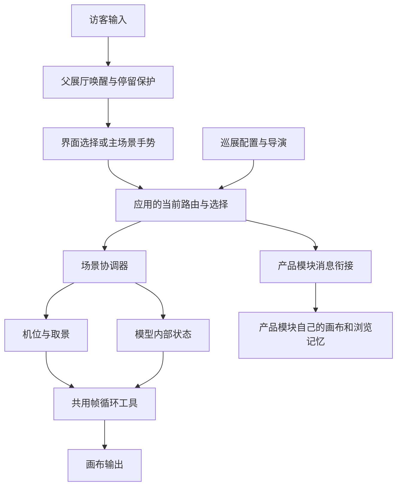

# 开发与扩展指南

本指南描述当前可运行代码，不把未来设想写成已经实现的能力。先读本目录 `AGENTS.md`，再按修改类型定位；不需要为一次修改预读全部历史资料。

## 一个产品，两个运行部分，九类职责

四区是业务导航，下面九类是开发职责，并不是九个独立应用。主展厅与品牌产品模块使用独立画布，以保留产品模块的独立使用能力和内部浏览状态。

| 职责 | 当前入口 | 负责什么，不负责什么 |
|---|---|---|
| 应用外壳与界面 | `src/App.jsx`、`SystemBar.jsx`、`src/config/areas.js` | 路由、四区导航、语言、访客选择；不生成模型几何 |
| 内容与配置 | `public/data/`、`homeStoryContent.js`、`locationProfiles.js`、`../共享数据/` | 双语内容、地域角色、真实资料与示意状态；不直接移动镜头 |
| 场景与模型 | `ConnectedOverviewWorld.js`、`HomeStoryWorld.js`、`CapabilityWorld.js`、`CompanyNewsWorld.js`、`DataWorkstation.js` | 创建对象、内部形变、轮廓与触点；不创建全局导航和空闲计时 |
| 渲染与环境 | `ConnectedScene.jsx`、`components/rendering/`、`../共享组件/spaceAtmosphere.js`、`../共享组件/frameLoop.js` | 画布、灯光、环境、后处理、帧生命周期；不决定业务路由 |
| 镜头与动作 | `inspectionPose.js`、`sceneFraming.js`、`overviewLayout.js`、`src/media/cameraJourney.js` | 展示机位、整体环绕、轮廓取景、电视靠近与返回；模型内部运动仍由模型实现 |
| 触摸与交互 | `src/interaction/scenePointer.js`、`visibleHit.js`、`src/hooks.js` | 主展厅手势分类、遮挡判断、对话框焦点；具体选中对象由场景决定 |
| 静置与巡展 | `src/config/presentation.js`、`exhibitionDirector.js`、`useExhibition.js` | 镜头清单、唯一空闲导演、唤醒与停留保护；不承担逐帧渲染 |
| 图文与媒体 | `DocumentReader.jsx`、`MediaTheatre.jsx`、`src/documents/`、`src/media/` | 阅读、图集、图片放大、影片列表与播放；不会自行跳到另一个业务区 |
| 产品模块衔接 | `ProductExplorer.jsx`、`../品牌融合世界/src/main.jsx`、`scene.js` | 有校验的消息、语言/可见性/巡展同步与内部状态保留；不复制父系统栏 |

表中的场景组件路径均位于 `src/components/`，除非另有标注。当前数据工作台内部模型是 `src/analytics/AnalysisInstrument.js`；`IntelligenceSculpture.js` 保留为旧实现，主场景不再调用，未经授权不删除。

## 状态和运行顺序



- `App.jsx` 持有访客当前选择、阅读器/影片打开状态，以及巡展前后的快照。导航别名仍保留内部语义，`brands` 不会被改写为产品首页。
- `ConnectedScene.jsx` 是三维组合与过渡协调器：把业务状态送入不同模型，组合镜头和灯光，投影可点击标签。它仍然比较大；本次没有把各类艺术场景强行改成同一套配置模板。
- 模型只更新当前对象，不读取浏览器路由，不启动自己的空闲导演。相机预设和自由观察方向分别保存。
- 产品模块持续挂载以保留筛选与款式，但不可见时暂停帧循环。嵌入模式由父展厅控制巡展；独立模式可保留自身展示控制。
- 两端共用 `frameLoop.js` 的实现，各自持有一个实例。逐帧渲染、空闲巡展、影片播放列表是三种不同循环，不应合并成一个大计时器。

### 三种循环的边界

| 循环 | 谁拥有 | 什么时候停止/恢复 |
|---|---|---|
| 绘制帧与模型运动 | 每个画布的帧循环实例 | 路由隐藏、阅读/手动影片等暂停、浏览器隐藏时取消帧调度；恢复从零增量开始 |
| 静置与跨区巡展 | 父展厅的 `useExhibition` + 导演 | 按住触点、阅读、手动视频或页面隐藏保护停留；首次输入唤醒并恢复访客状态 |
| 当前影片列表 | `MediaTheatre` + 媒体库 | 只在影片空间内推进视频；自动影片受巡展镜头停留时间约束 |

默认静置 30 秒、巡展 90 秒，配置在 `src/config/presentation.js`。`public/data/showroom.json` 中的 `settings.idleSeconds` 可覆盖巡展等待时间；异步加载后也会生效。界面淡出时间仍在样式中，不等于镜头停留时间。

## 新功能究竟改几处

| 要做的事 | 修改位置 | 是否只改配置 |
|---|---|---|
| 修改四区名称或英文 | `src/config/areas.js` 的 `label` / `overview` | 是；名称和模型顺序集中维护 |
| 修改加载提示 | `src/config/uiCopy.js` | 是；懒加载和场景准备共用文案 |
| 增加新闻、图片或分析正文 | `public/data/reading-documents.json`、`exhibition-media.json`，以及本地媒体 | 内容格式已支持时是；原始文件仍须整理 |
| 增加现有场景的自动巡展镜头 | `src/config/presentation.js` 的 `exhibitionShots` | 是，但镜头引用的地点、章节、影片必须已经存在 |
| 改已存在地区的业务介绍 | `locationProfiles.js` 和对应真实数据 | 多数是；不能用文字配置冒充新空间模型 |
| 调整画质、曲面精度、阴影和既有细纹 | `../共享组件/qualityConfig.js`，见[画质与模型维护](画质与模型维护.md) | 是；修改后重新构建两端 |
| 改某模型材质或造型 | 对应模型工厂 | 否；需实现材质/几何并看实际画面 |
| 新增可点击展品或独立场景 | 模型工厂、场景协调、机位、触点、内容入口 | 否；需要完整的视觉与交互接入 |
| 新增产品或款式 | 品牌模块与共享数据自己的扩展流程 | 不保证只改清单；模型类型、媒体、归属和款式关系均需存在 |
| 新增整个业务区 | 四区配置之外，还要业务页面、场景和返回/巡展逻辑 | 不在当前四区范围内，不能只加导航按钮 |

### 示例：给已有质量空间追加巡展镜头

在 `exhibitionShots` 中安排一个有唯一 ID（标识）的条目：

```js
{ id: 'quality-detail-return', page: 'locations', location: 'cambodia',
  mode: 'network', capability: 'quality', seconds: 20 }
```

这里引用现有柬埔寨质量场景，不会创建新模型。调整顺序即可调整巡展次序；`seconds` 是镜头停留时间。影片镜头还包含切近景时间，不能设得比过渡更短。新增条目前应核对是否与已有镜头重复。

### 示例：增加带图片的文档

按 `src/documents/README.md` 的实际格式，在文档对应 ID 下维护 `sections`。正文块可以按顺序混排段落、图片和相册。配置本地文件的真实路径，不用占位空链接。

资料准备和业务触发是两件事：覆盖已有文档只维护内容；一个全新的按钮仍需在对应页面绑定统一的 `onDocument` 入口。不要在模型内部自己创建另一套阅读浮层。

## 新模型的接入步骤

1. 明确所属区域与展示角色。是总览主角、已有章节里的展品，还是深入后的业务空间；不要为了丰富度在首页增加无关物件。
2. 在对应工厂实现几何、材质及局部动画。首页中心看 `BrandMonument.js`；新闻看 `CompanyNewsWorld.js` 和 `MediaExhibits.js`；数据看 `DataWorkstation.js` 与 `analytics/AnalysisInstrument.js`；地区看 `LocationArchitecture.js`、`LocationScenery.js`、`regionLayouts.js`。
3. 沿用现有场景接口：所有当前工厂提供 `root` 与 `update`；需要点击和近景的场景再提供 `pick`、`point`、`bounds` 等。接口参数目前按场景语义不同，不存在无需实现就能套用的万能模型协议。
4. 在 `ConnectedScene.jsx` 的创建、状态更新、选中/返回路径中接入对象。每帧由协调器传入时间和增量；不在模型中新增帧循环、全局键盘监听或路由切换。
5. 用真实几何的轮廓取景。公司场景使用 `sceneFraming.js` 与 `inspectionPose.js`；地点场景同步 `regionLayouts.js`、对应镜头与热点坐标。先确定展示机位，再允许访客自由观察。
6. 把模型命中结果变成业务选择，让已有页面逐层展开文字，再通过统一阅读器打开全文。拖动/取消不能命中跳转；标签需避让文字和系统栏。
7. 明确释放责任。仍在主场景树中的普通几何、材质、纹理由主协调器回收；从树中移除的临时对象、独占视频纹理、监听器等由创建者清理。共享纹理不能被单个模型提前释放。
8. 验证选中、重复选中、快速切换、返回、静置、巡展和不同尺寸；之后才把完成的场景加入巡展清单。

`scenePointer.js` 统一主展厅的点击/拖动判断，但不替场景决定“拖动后该转什么”。地球转地球、公司转场景、近景转检查角度，这些动作仍有独立设计。品牌模块的双指缩放与款式浏览保留原有控制器。

## 界面样式与素材边界

当前主展厅的加载顺序为 `styles.css → experience.css → immersive.css → home-story.css → atrium.css`，阅读器和媒体另有局部样式。它们共用现有界面，但尚不是全部由统一设计变量驱动的组件库。修改时先定位最终生效的规则，避免继续向文件末尾追加重复覆盖。一次局部功能不应重写全部样式。

本轮没有改变批准过的视觉。主展厅样式构建指纹保持不变；后续若要改材质、灯光或构图，仍须用实际画面验收，不能因为模块结构清楚就认为视觉自动合格。

产品模块的导出目录是生成产物，修改源文件再构建导出。共享背景或帧循环改动须重建产品模块和主展厅。品牌内部业务测试不因外壳调整自动扩大。

## 检查与交付

常用命令见 README。现有测试包括路由归属、阅读安全与内容顺序、巡展计时、媒体靠近/返回、轮廓取景、预设机位、可见命中及共享帧/手势生命周期。

有复杂交互变化时，还要实际打开主展厅，检查公司、工厂、数据的进入返回与品牌衔接。模型截图、测试通过、静态构建、连续运行和实机触摸是不同证据。验收记录应写明具体范围和未验证事项。

托管模板保留，但本地整理不等于发布。不要因 README 里存在托管文件就主动创建外部站点或分享公司资料。


## 导航与资料入口的扩展

- `src/config/navigation.js` 负责各场景提供哪些章节；`SystemBar.jsx` 负责统一呈现。新增章节时补对应内容和场景映射，不在页面内加第二条导航栏。
- 产品目录与样品空间同属产品区域。`../共享组件/explorerViews.js` 区分具体浏览意图，父子通过已校验的 `view` 与 `section` 同步。保留 `preserve` 的返回恢复语义。
- 右上箭头打开文档/资料来源；向右箭头进入场景；普通模型与筛选按钮只表达选中状态。按钮必须能产生与标签相符的结果。
- 公司概览、协作网络、发展历程的文档由 `src/documents/content.js` 按章节创建。新文档提供双语标题、正文与图片说明，来源文件名保留原样。
- 阅读器通过 `captureReadingAnchor` 与 `restoreReadingAnchor` 在语言、字号变化时保留章节位置。传入明确章节时优先进入该章节；普通重开则恢复阅读记忆。
